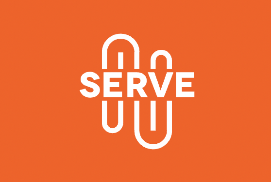

<pre>                             </pre>

# Serve

Roughly 1 in 3 senior citizens in the United States live below the Federal Poverty Line. With **Serve**, this population gains access to essential Convenience, Health, Legal, and Connection services. 

## What is Serve?
Serve is a Java Desktop application that motivates community members & specialists to consciously build their community through volunteerism.
- Senior citizen "Clients" and community volunteers apply and are vetted thoroughly by Serve's in-house Application Manager
- Participating Grocery Stores and Pharmacies curate a discounted convenience product catalog
- Community Members deliver client-ordered convenience products
- Healthcare and Legal organizations set-up a catalog of specialized services and register Serve-verified physicians and lawyers to fulfill client requests
- Schools and other Community Organizations (Boy Scouts of America) manage a catalog of activities aimed to engage seniors on a human level; volunteer cohorts sign-up for activities on client request

## Who contributed to Serve?

|Contributor     | App-Scope |Requirements-Scope |
|--|--|--|
|  *Team*| Serve "Model" Package|Model, System Admin Chart, Enterprise Charts, Git VC, Error Handling/Null Checks, UI/UX design and Alignment, Relevant Data Types, Sample Data|
|  Vishnu Rao-Sharma| Client Marketplace, Service Organization Management, Product Organization Management, Client Registration|Cross-Organization Request Creation, Request Creation, Form Validations, Documentation (README, UML, Component Diagram), Charts|
|  Khatantuul Batbold|Product Request Management, Service Request Management, Application Request Management (Client, Volunteer, Specialist) |Request Management, Status Management, Cross-Enterprise Request Creation, Gmail Integration| 
|  Siqi Yang| System Admin Management, Enterprise Admin Management, User Login, Volunteer Registration  |System Admin CRUD, Enterprise Admin CRUD, Unique IDs|

## [Detailed UML](https://app.diagrams.net/?&highlight=0000ff&edit=_blank&layers=1&nav=1&title=exported_from_idea.drawio#G1KUZxRy0It9VnvkC1bvy0FKbGtCS7MyyL)

